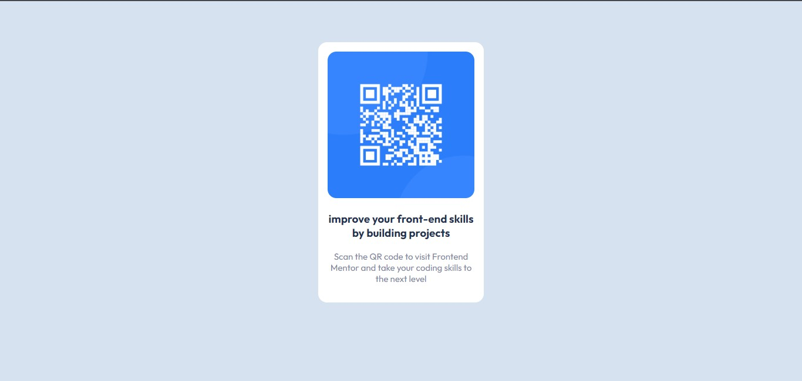

# Frontend Mentor - QR code component solution

This is a solution to the [QR code component challenge on Frontend Mentor](https://www.frontendmentor.io/challenges/qr-code-component-iux_sIO_H). Frontend Mentor challenges help you improve your coding skills by building realistic projects. 

## Welcome! 👋

i started frontend mentor challenges to test and improve my coding skils

## The challenge

the challenge is to build out this QR code component and get it looking as close to the design as possible.

## tools used to design

no external tools such as framework used to designing.

only:

HTML

CSS

FlexBox

### Screenshot

